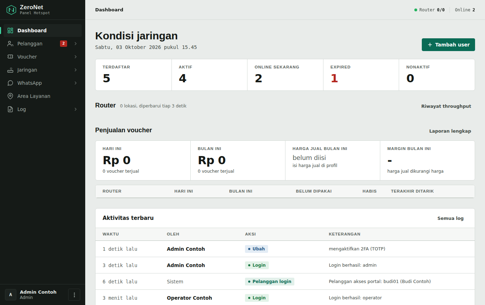
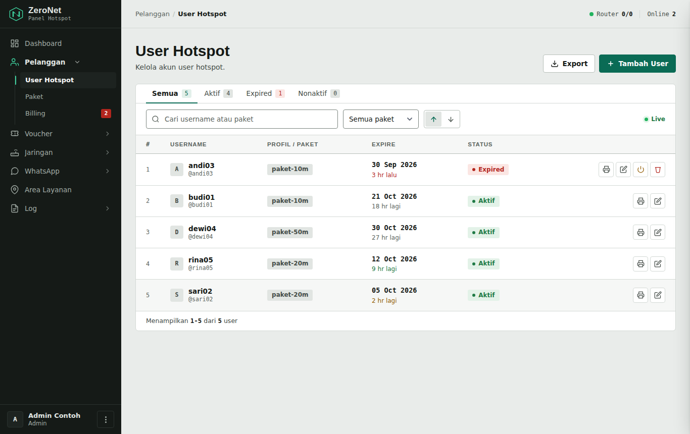
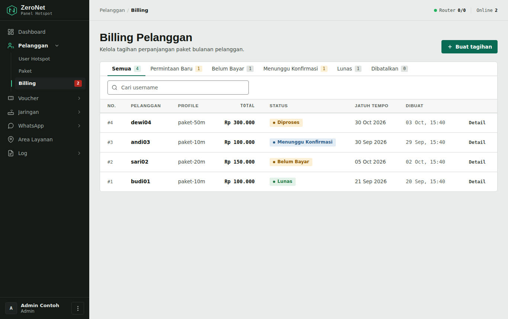
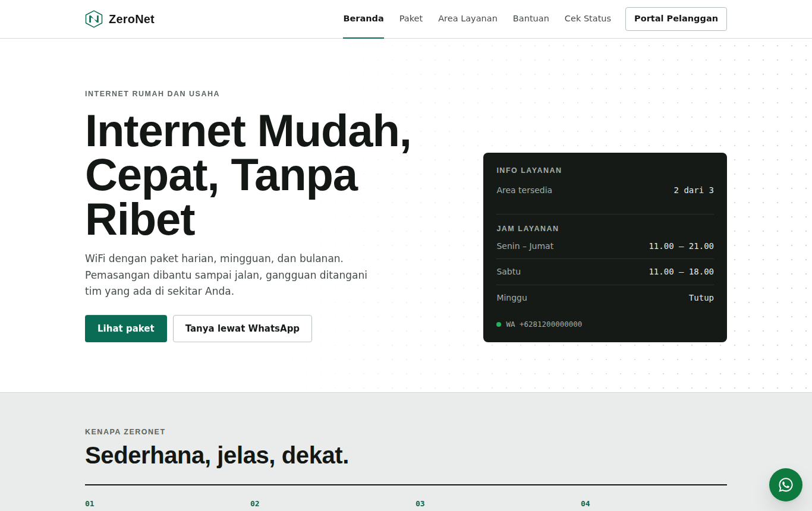
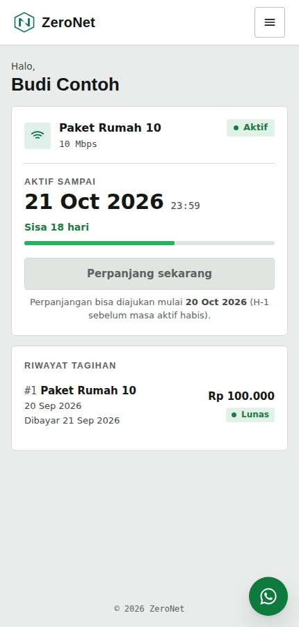
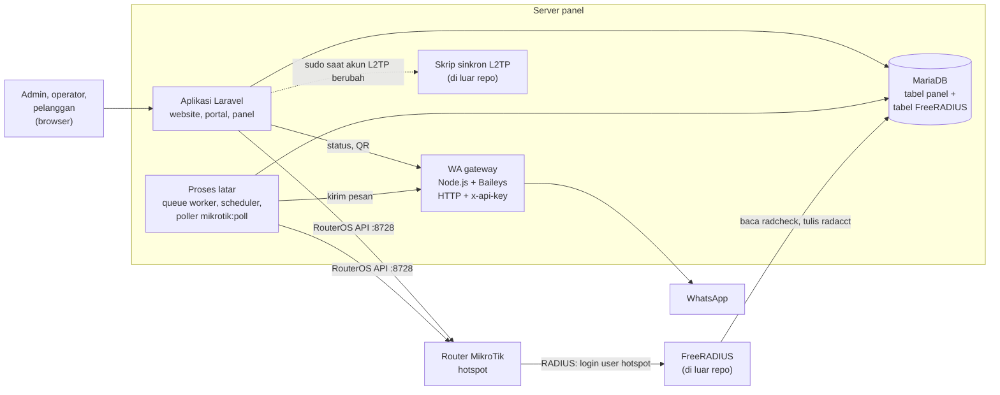

# ZeroNet

Panel admin, portal pelanggan, dan website untuk usaha hotspot WiFi RT/RW Net berbasis MikroTik dan FreeRADIUS.

ZeroNet membantu pengelola RT/RW Net menjual paket bulanan (akun RADIUS) dan voucher hotspot MikroTik dari satu panel. Admin mengelola pelanggan, tagihan, voucher, dan router lewat browser. Pelanggan mengecek masa aktif, melihat tagihan, dan mengirim bukti transfer dari HP.

> **Status:** pemilik repo memakai ZeroNet di produksi untuk usaha RT/RW Net-nya. Bagian [Integrasi](#integrasi) mencatat mana yang sudah dan belum diuji di luar lingkungan pemilik.

## Daftar isi

- [Screenshot](#screenshot)
- [Fitur yang tersedia](#fitur-yang-tersedia)
- [Arsitektur](#arsitektur)
- [Teknologi dan persyaratan](#teknologi-dan-persyaratan)
- [Instalasi lokal](#instalasi-lokal)
- [Konfigurasi environment](#konfigurasi-environment)
- [Database](#database)
- [Queue, scheduler, dan poller](#queue-scheduler-dan-poller)
- [Integrasi](#integrasi)
- [Cara pakai](#cara-pakai)
- [Tes](#tes)
- [Troubleshooting](#troubleshooting)
- [Keterbatasan](#keterbatasan)
- [Belum tersedia](#belum-tersedia)
- [Kontribusi](#kontribusi)
- [Lisensi](#lisensi)

## Screenshot

Semua screenshot memakai data contoh fiktif.

| Dashboard admin | User hotspot |
|---|---|
|  |  |
| **Billing** | **Website publik** |
|  |  |

Portal pelanggan di HP:



## Fitur yang tersedia

Daftar ini disusun dari route dan controller di repo. Fitur yang butuh perangkat atau layanan di luar repo diberi catatan.

### Website publik

- Beranda, daftar paket, area layanan, dan halaman bantuan.
- Cek status akun tanpa login (`/status`): pengunjung memasukkan username atau nomor HP, lalu melihat masa aktif dan status online. Nama dan username ditampilkan tersamar.

### Portal pelanggan

- Login dengan username dan password akun hotspot (tabel `radcheck`), di `/login`.
- Wajib mengisi nomor WhatsApp setelah login pertama.
- Melihat paket, masa aktif, dan riwayat tagihan.
- Mengajukan perpanjangan saat masa aktif tinggal 24 jam atau sudah habis.
- Mengunggah bukti transfer untuk tagihan.
- Tautan tagihan publik `/i/{slug}` yang bisa dibuka tanpa login.

### Panel admin (`/admin`)

Panel punya dua role: **admin** dan **operator**. Operator tidak bisa membuka menu bertanda *(admin)* atau menjalankan aksi yang ditulis "khusus admin".

| Menu | Isi |
|---|---|
| Dashboard | Jumlah user, sesi online, status router, ringkasan penjualan voucher, aktivitas terbaru. |
| Pelanggan › User Hotspot | Tambah, ubah, aktifkan/nonaktifkan, dan perpanjang akun RADIUS. Hapus akun khusus admin. |
| Pelanggan › Paket | Paket RADIUS (rate limit, harga, masa aktif, tampil di website) dan profil hotspot per router. Ubah paket khusus admin. |
| Pelanggan › Billing *(admin)* | Tagihan manual, konfirmasi pembayaran yang otomatis memperpanjang akun. |
| Voucher › Generator Voucher | Buat batch voucher hingga 1000 kartu, kirim ke router lewat antrean, cetak, unduh CSV, hapus. Membuat dan menghapus khusus admin. |
| Voucher › Cek Voucher | Cari kode voucher di router: status, pemakaian, perangkat. |
| Voucher › Penjualan *(admin)* | Laporan penjualan dari catatan penjualan gaya Mikhmon di router, unduh CSV, cetak. |
| Voucher › Template Cetak *(admin)* | Editor template kartu voucher dengan pratinjau. |
| Voucher › Generator Voucher › tombol **Script Router** *(admin)* | Pasang script on-login dan scheduler kedaluwarsa voucher ke router, kelola profil hotspot router. |
| Jaringan › Manajemen Router | Tambah router (API MikroTik), status live, reboot, unduh backup, cek kesehatan script. Wizard membuat akun API khusus panel. Operator hanya bisa melihat daftar, detail, dan statistik router; selebihnya khusus admin. |
| Jaringan › Hotspot Aktif | Sesi hotspot aktif per router. Putus sesi khusus admin. Butuh poller. |
| Jaringan › Load Balance | Lihat dan ubah load balance PCC per WAN setelah pratinjau. Ubah khusus admin. |
| Jaringan › Throughput | Grafik trafik WAN live dan riwayat 7/14/30 hari. |
| Jaringan › VPN L2TP *(admin)* | Kelola akun L2TP. Butuh skrip sinkron di server yang **tidak ada di repo**, lihat [Integrasi](#l2tp). |
| WhatsApp › WhatsApp Gateway *(admin)* | Status dan QR gateway, kirim pesan, broadcast, kontak pelanggan. |
| WhatsApp › Template Pesan, Notifikasi WA *(admin)* | Teks pesan otomatis dan nomor admin penerima notifikasi. |
| Website › Area Layanan *(admin)* | Area cakupan yang tampil di website. |
| Log › Log Hotspot | Log autentikasi RADIUS dan log hotspot router. |
| Log › Log Aktivitas *(admin)* | Jejak aksi admin, operator, dan pelanggan. |
| Menu akun › Operator *(admin)* | Kelola akun panel. |
| Menu akun › Profil saya, Verifikasi 2 langkah | Ganti nama, username, dan password; aktifkan TOTP dengan kode pemulihan. |

### Keamanan login panel

- Login admin memakai **username**, bukan email.
- 2FA TOTP wajib untuk role di `TWO_FACTOR_REQUIRED_ROLES` (bawaan: `admin`).
- Percobaan login gagal memicu jeda yang makin lama per username dan IP.
- Password ulang diminta saat menghapus user hotspot atau operator, menghapus voucher secara massal atau ikut dari router, dan menerapkan load balance.
- Tidak ada registrasi publik dan tidak ada reset password lewat email.

### Tugas otomatis

| Command | Jadwal | Fungsi |
|---|---|---|
| `router:rutin` | tiap 5 menit | Menjalankan `traffic:sample`, `radacct:reconcile`, `voucher:penjualan`, dan `voucher:sinkron` (tiap 15 menit). |
| `wa:reminders` | tiap jam | Pengingat masa aktif ke pelanggan yang punya kontak. Kalau `BILLING_WA_NOTIFICATIONS=true`, juga membuat tagihan otomatis untuk pelanggan yang pernah lunas dan belum punya tagihan terbuka. |
| `wa:daily-summary` | 08:00 | Ringkasan harian ke nomor admin. |
| `wa:watchdog` | tiap 5 menit | Peringatan kalau gateway WA putus lebih dari 15 menit. |
| `voucher:penjualan --penuh` | 03:15 | Tarik ulang semua catatan penjualan. |
| `logs:archive`, `logs:cleanup`, `router:log-bersihkan`, `queue:prune-failed` | harian/bulanan | Arsip dan bersihkan log. |

Daftar command lengkap ada di [docs/ARSITEKTUR.md](docs/ARSITEKTUR.md#command-artisan).

## Arsitektur



Panel dan FreeRADIUS memakai database yang sama. Panel menulis akun ke `radcheck` dan `radusergroup`; FreeRADIUS membacanya saat router MikroTik meminta autentikasi. Voucher berbeda jalurnya: panel membuat voucher sebagai user hotspot lokal di router lewat RouterOS API.

Proses latar terdiri dari queue worker (WhatsApp, push voucher), scheduler (tugas berkala), dan poller (status router ke cache). Ketiganya berjalan terpisah dari web server.

Detail koneksi router, poller, cache, dan alur voucher ada di [docs/ARSITEKTUR.md](docs/ARSITEKTUR.md).

## Teknologi dan persyaratan

| Komponen | Versi | Sumber |
|---|---|---|
| PHP | 8.3 atau lebih baru | `composer.json` (`^8.3`) |
| Laravel | 13 (terkunci v13.34.0) | `composer.lock` |
| Ekstensi PHP | `pdo_mysql`, `mbstring`, `openssl`, `tokenizer`, `xml`/`dom`, `ctype`, `fileinfo`, `iconv`; `ftp` untuk backup router lewat FTP; `zip` untuk `logs:archive`; `redis` kalau memakai Redis dengan `phpredis` | `composer check-platform-reqs` dan kode |
| Composer | 2.x | |
| Node.js | `^20.19` atau `>=22.12` | `engines` Vite 8 di `package-lock.json` |
| Database | MariaDB. Diuji dengan MariaDB 10.6.23 dan 10.11.14 | Dump schema dibuat `mariadb-dump` versi baru |
| Klien CLI `mysql`/`mariadb` | wajib di server yang menjalankan `migrate` | Laravel memuat dump schema lewat klien ini |
| Redis | opsional | Kode memakai cache dan queue Laravel; bawaan `.env.example` memakai driver `database` |
| FreeRADIUS | tidak ditentukan | Konfigurasi tidak ada di repo |
| RouterOS | tidak ada matriks kompatibilitas | Klien API mendukung login lama (MD5) dan baru; script voucher membedakan format tanggal RouterOS di bawah 7.10 dan 7.10 ke atas |
| PM2 | diuji 7.0.4 | Untuk proses yang harus selalu hidup |

Frontend memakai Tailwind CSS, Alpine.js, dan Vite. Halaman panel juga memuat CSS dan JS statis dari `public/assets/` serta font dari Google Fonts.

## Instalasi lokal

Langkah ini sudah diuji dari clone bersih di dua lingkungan: Ubuntu 24.04 (PHP 8.3.6, Node 22, MariaDB 10.11) dan Ubuntu 22.04 (PHP 8.3.30, Node 20, MariaDB 10.6). Hasil ujinya ada di [docs/PENGUJIAN.md](docs/PENGUJIAN.md).

1. Clone repo dan pasang dependency:

   ```bash
   git clone https://github.com/nekomaa110-gif/ZeroNet.git zeronet
   cd zeronet
   composer install
   npm ci
   npm run build
   ```

2. Buat database dan user MariaDB. Ganti `ganti-password-ini`:

   ```bash
   sudo mariadb -e "CREATE DATABASE zeronet CHARACTER SET utf8mb4 COLLATE utf8mb4_unicode_ci;
   CREATE USER 'zeronet'@'localhost' IDENTIFIED BY 'ganti-password-ini';
   GRANT ALL PRIVILEGES ON zeronet.* TO 'zeronet'@'localhost';"
   ```

3. Salin `.env` dan buat `APP_KEY`:

   ```bash
   cp .env.example .env
   php artisan key:generate
   ```

4. Buka `.env`, lalu isi minimal:

   ```dotenv
   DB_PASSWORD=ganti-password-ini

   ADMIN_SEED_NAME="Admin"
   ADMIN_SEED_USERNAME=admin
   ADMIN_SEED_EMAIL=admin@example.test
   ADMIN_SEED_PASSWORD=password-admin-yang-kuat
   ```

   `APP_DOMAIN=127.0.0.1` dari `.env.example` sudah cocok untuk lokal. Isi juga `OPERATOR_SEED_*` kalau ingin akun operator.

5. Buat tabel, akun admin, dan symlink storage:

   ```bash
   php artisan migrate
   php artisan db:seed
   php artisan storage:link
   ```

   `migrate` memuat `database/schema/mysql-schema.sql` lebih dulu, lalu menjalankan migration yang lebih baru.

6. Jalankan server:

   ```bash
   php artisan serve --host=127.0.0.1 --port=8000
   ```

7. Buka alamat berikut. Gunakan `127.0.0.1`, bukan `localhost`, karena route hanya melayani host di `APP_DOMAIN`.

   | Halaman | URL |
   |---|---|
   | Website | http://127.0.0.1:8000/ |
   | Portal pelanggan | http://127.0.0.1:8000/login |
   | Panel admin | http://127.0.0.1:8000/admin/login |

   Login admin pertama langsung meminta setup 2FA. Siapkan aplikasi authenticator (Google Authenticator, Aegis, atau sejenisnya).

Saat pengembangan, jalankan queue worker dan poller, masing-masing di terminal sendiri:

```bash
php artisan queue:work
php artisan mikrotik:poll
```

Pemasangan di server produksi (web server, cron, PM2, gateway WA) dijelaskan di [docs/DEPLOY.md](docs/DEPLOY.md).

## Konfigurasi environment

Variabel yang paling sering diubah:

| Variabel | Contoh | Fungsi |
|---|---|---|
| `APP_DOMAIN` | `127.0.0.1` / `panel.example.com` | Host yang dilayani semua route web. Host lain mendapat 404, kecuali `/up`. |
| `APP_URL` | `http://127.0.0.1:8000` | URL dasar aplikasi. |
| `DB_CONNECTION` | `mysql` | Harus `mysql`, juga untuk server MariaDB. |
| `ADMIN_SEED_*`, `OPERATOR_SEED_*` | | Akun yang dibuat `db:seed`. Akun dilewati kalau salah satu nilainya kosong. |
| `TWO_FACTOR_REQUIRED_ROLES` | `admin` | Role yang wajib 2FA. |
| `QUEUE_CONNECTION`, `CACHE_STORE` | `database` | Boleh diganti `redis`. |
| `DB_QUEUE_RETRY_AFTER` | `660` | Harus lebih besar dari timeout push voucher (600 detik). |
| `BUSINESS_WA`, `ADMIN_NOTIF_WA` | `62...` | Nomor WhatsApp bisnis dan penerima notifikasi admin. |
| `BILLING_REKENING` | `Bank Contoh\|1234567890\|NAMA` | Rekening tujuan transfer, format `bank\|nomor\|atas nama`, dipisah titik koma. |
| `WA_GATEWAY_URL`, `WA_GATEWAY_KEY` | | Alamat dan kunci gateway WA. |
| `BILLING_WA_NOTIFICATIONS`, `BILLING_WA_TEST_MODE` | `false`, `true` | Saklar semua WA otomatis (billing, pengingat, notifikasi admin, ringkasan harian) dan mode uji yang mengalihkan pesan otomatis ke nomor uji. Bawaan: mati. |

Tabel lengkap, termasuk backup router, WhatsApp Cloud API, dan teks voucher, ada di [docs/KONFIGURASI.md](docs/KONFIGURASI.md).

## Database

- Tabel FreeRADIUS (`radcheck`, `radreply`, `radacct`, `radusergroup`, `radgroupcheck`, `radgroupreply`, `radpostauth`, `nas`) dan tabel `invoice` **tidak dibuat oleh migration**. Tabel-tabel itu hanya ada di `database/schema/mysql-schema.sql`.
- Karena itu `DB_CONNECTION` wajib `mysql`. Dengan `mariadb` atau `sqlite`, Laravel tidak memuat dump dan `migrate` gagal di tabel `invoice`.
- Dump hanya berisi struktur, tanpa data kecuali daftar migration yang sudah dijalankan.
- Dump juga memuat tabel yang tidak dipakai kode: `admin`, `admin_log`, `user_record`, `realms`.
- `db:seed` hanya membuat akun panel. Tidak ada seeder untuk paket, router, atau pelanggan.

## Queue, scheduler, dan poller

| Proses | Perintah | Wajib untuk |
|---|---|---|
| Queue worker | `php artisan queue:work --sleep=3` | Kirim WhatsApp, push voucher ke router, impor voucher. |
| Scheduler | `* * * * * php artisan schedule:run` di crontab | Semua [tugas otomatis](#tugas-otomatis). |
| Poller | `php artisan mikrotik:poll` | Halaman Hotspot Aktif dan log router. Dashboard dan grafik trafik lebih cepat dengan poller; tanpa poller, panel membaca router langsung. |

Poller keluar sendiri setelah satu jam (`--max-time=3600`, minimal 60 detik) supaya kode baru termuat. Jalankan di bawah process manager yang menyalakannya ulang, misalnya PM2. Contoh konfigurasi ada di [docs/DEPLOY.md](docs/DEPLOY.md#proses-latar-belakang).

## Integrasi

### MikroTik

- Panel memakai RouterOS API biner di port **8728 tanpa TLS**. API-SSL (8729) belum didukung.
- Kredensial router disimpan di tabel `routers`; password dienkripsi dengan `APP_KEY`. Jangan mengganti `APP_KEY` setelah router ditambahkan.
- Router ditambah dari menu **Jaringan › Manajemen Router**. Wizard sesudahnya bisa membuat akun API `zeronet-api` dengan policy `api,read,write,policy,test,reboot,sensitive`.
- Backup router memakai FTP (port 21) atau SFTP kalau `ROUTER_BACKUP_SFTP_HOST` diisi.
- **Status uji:** belum dicoba dengan router MikroTik nyata. Tes otomatis memakai router tiruan (`tests/Support/router-palsu.php`).

### FreeRADIUS

- Panel hanya menulis dan membaca tabel FreeRADIUS di database yang sama. Konfigurasi FreeRADIUS (modul `sql`, client NAS, atribut kedaluwarsa) **tidak ada di repo**.
- Atribut yang dipakai panel antara lain `Cleartext-Password`, `Expiration`, `Simultaneous-Use`, dan `Mikrotik-Rate-Limit`.
- Router MikroTik harus diarahkan ke FreeRADIUS untuk autentikasi hotspot.
- **Status uji:** belum dicoba dengan FreeRADIUS. Pengujian hanya memeriksa data di tabel.

### WhatsApp

- Gateway self-hosted ada di [`deploy/wa-gateway`](deploy/wa-gateway/README.md) (Node.js 20+, Baileys, Express, Puppeteer). Gateway hanya mendengarkan `127.0.0.1:3001` dan menolak request tanpa header `x-api-key` yang benar.
- Scan QR dilakukan dari panel: **WhatsApp › WhatsApp Gateway** → tombol **Panel gateway**.
- WA otomatis (notifikasi billing, pengingat, notifikasi admin, ringkasan harian) hanya terkirim kalau `BILLING_WA_NOTIFICATIONS=true`. Selama `BILLING_WA_TEST_MODE=true`, pesan otomatis untuk pelanggan dialihkan ke `BILLING_WA_TEST_NUMBER`.
- **Kirim manual dan broadcast dari menu WhatsApp Gateway tidak membaca kedua saklar itu** dan langsung terkirim ke nomor pelanggan.
- Gambar tagihan dirender gateway dari `https://{APP_DOMAIN}/i/{slug}?image=1`, jadi gateway harus bisa membuka domain panel lewat HTTPS.
- Tombol **Cloud API** di halaman WhatsApp Gateway menjalankan onboarding Meta (Embedded Signup), verifikasi nomor, dan subscribe WABA. Pengiriman pesan tetap lewat gateway.
- **Status uji:** gateway berhasil start, menolak key salah, dan panel membaca statusnya. Pairing ke WhatsApp dan pengiriman pesan belum diuji.

### L2TP

- Menu VPN L2TP menyimpan akun di tabel `l2tp_accounts`, lalu mengirim isi `chap-secrets` ke `sudo -n /usr/local/sbin/l2tp-sync-secrets` lewat STDIN.
- Skrip itu dan aturan sudoers-nya **tidak ada di repo**. Tanpa keduanya, panel menampilkan galat, tetapi perubahan sudah tersimpan di tabel `l2tp_accounts` dan belum masuk `chap-secrets`.
- Alamat tunnel diatur lewat `L2TP_LOCAL_IP` dan `L2TP_RESERVED` di `.env`, rentang pool di `config/l2tp.php`.
- **Status uji:** belum diuji.

## Cara pakai

Urutan awal setelah instalasi:

1. Login ke `/admin/login`, selesaikan setup 2FA, simpan kode pemulihan.
2. **Jaringan › Manajemen Router** → tambah router (host, port 8728, user, password) → tes koneksi → ikuti wizard.
3. **Pelanggan › Paket** → buat paket RADIUS: nama grup, rate limit, harga, masa aktif.
4. **Pelanggan › User Hotspot** → tambah user dengan paket dan tanggal kedaluwarsa. User ini bisa login hotspot (lewat FreeRADIUS) dan portal pelanggan.
5. **Pelanggan › Billing** → buat tagihan (langsung terbit), lalu konfirmasi setelah pelanggan membayar. Konfirmasi memperpanjang masa aktif user. Tagihan draft dari permintaan perpanjangan pelanggan perlu diterbitkan dulu. Tagihan baru ditolak kalau user belum punya password atau masih punya tagihan terbuka.
6. **Voucher › Generator Voucher** → tombol **Script Router** → pasang script on-login di router. Kembali ke Generator Voucher → buat batch → cetak.
7. Isi `WA_GATEWAY_KEY`, jalankan gateway, lalu **WhatsApp › WhatsApp Gateway** → tombol **Panel gateway** → scan QR.

## Tes

Tes memakai database MariaDB terpisah yang namanya harus berakhiran `_test`. `tests/TestCase.php` menghentikan tes kalau syarat ini tidak terpenuhi.

```bash
sudo mariadb -e "CREATE DATABASE zeronet_test CHARACTER SET utf8mb4 COLLATE utf8mb4_unicode_ci;
CREATE USER 'zeronet_test'@'localhost' IDENTIFIED BY 'password-tes';
GRANT ALL PRIVILEGES ON zeronet_test.* TO 'zeronet_test'@'localhost';"

DB_USERNAME=zeronet_test DB_PASSWORD=password-tes php vendor/bin/phpunit -c phpunit.mariadb.xml
```

Saat dokumentasi ini ditulis, 158 tes lolos. Tes yang membutuhkan router memakai router tiruan (`tests/Support/router-palsu.php`), bukan router asli.

`phpunit.xml` (SQLite) tidak bisa dipakai karena tabel FreeRADIUS dan SQL khusus MariaDB.

Jangan menjalankan tes dari direktori produksi yang config-nya ter-cache: tes bisa menunjuk database asli.

## Troubleshooting

| Gejala | Penyebab dan solusi |
|---|---|
| Semua halaman 404, termasuk `/admin/login` | Host di browser tidak sama dengan `APP_DOMAIN`. Buka lewat host yang sama, misalnya `127.0.0.1`, bukan `localhost`. Domain ikut tersimpan di route cache, jadi setelah mengubah `APP_DOMAIN` di produksi jalankan `php artisan config:cache` **dan** `php artisan route:cache`. |
| `migrate` gagal: `Table 'invoice' doesn't exist` | `DB_CONNECTION` bukan `mysql`. Ubah ke `mysql`, kosongkan database, lalu ulangi `migrate`. |
| `migrate` gagal memuat schema | Klien `mysql`/`mariadb` belum terpasang atau terlalu lama untuk baris `/*M!999999\- enable the sandbox mode */` di awal dump. Pasang klien MariaDB versi baru. |
| `Vite manifest not found` | Jalankan `npm ci && npm run build`. |
| Admin selalu diarahkan ke halaman 2FA | Role admin wajib 2FA. Selesaikan setup dengan aplikasi authenticator. |
| Bukti transfer tidak tampil | Jalankan `php artisan storage:link`. |
| Hotspot Aktif kosong dan log router tidak bertambah | Poller tidak jalan. Jalankan `php artisan mikrotik:poll` atau cek proses PM2-nya. |
| Panel menampilkan gateway WA terputus | Cek gateway hidup (`curl -H "x-api-key: ..." http://127.0.0.1:3001/status`) dan `WA_GATEWAY_KEY` sama dengan `API_KEY` gateway. |
| WA otomatis tidak terkirim padahal gateway terhubung | `BILLING_WA_NOTIFICATIONS` masih `false`, atau `BILLING_WA_TEST_MODE` masih `true` sehingga pesan pelanggan masuk ke nomor uji. Queue worker juga harus jalan. |
| Simpan akun L2TP menampilkan galat sinkron | Skrip `/usr/local/sbin/l2tp-sync-secrets` atau aturan sudoers belum ada. Perubahan sudah tersimpan di database; jalankan ulang setelah skrip siap. Lihat [L2TP](#l2tp). |

## Keterbatasan

- Satu instalasi melayani satu domain (`APP_DOMAIN`).
- Koneksi API ke router tidak terenkripsi (port 8728). Lindungi dengan VPN atau batasi alamat yang boleh mengakses service API router.
- Konfigurasi FreeRADIUS, skrip sinkron L2TP, dan file PM2 untuk queue dan poller tidak disertakan.
- Bukti transfer pelanggan disimpan di disk `public` dan bisa dibuka siapa pun yang tahu URL-nya.
- Halaman tagihan publik `/i/{slug}` menampilkan nama dan nomor HP pelanggan tanpa login. Slug acak 24 karakter.
- Teks website (FAQ, jam layanan) diatur di `config/site.php`, belum dari panel.
- Ada beberapa route peninggalan tanpa tautan di UI, misalnya halaman paket lama dan `/admin/confirm-password`.
- Belum diuji dengan MySQL; dump schema dibuat dari MariaDB.

## Belum tersedia

Pemilik belum menetapkan roadmap. Hal berikut **belum ada** di kode:

- Pengiriman pesan lewat WhatsApp Cloud API (baru onboarding).
- Dukungan RouterOS API-SSL.
- Contoh konfigurasi FreeRADIUS dan skrip sinkron L2TP di repo.
- Seeder data contoh untuk paket, router, dan pelanggan.
- Manajemen OLT/ONT.

## Kontribusi

1. Ikuti [Instalasi lokal](#instalasi-lokal) dan pastikan tes MariaDB berjalan.
2. Buat branch dari `master`, satu topik per branch.
3. Sebelum membuat pull request, jalankan:

   ```bash
   vendor/bin/pint --dirty
   DB_USERNAME=zeronet_test DB_PASSWORD=password-tes php vendor/bin/phpunit -c phpunit.mariadb.xml
   ```

4. Jangan pernah meng-commit `.env`, dump database, log, sesi WhatsApp (`deploy/wa-gateway/auth/`), atau data pelanggan.

Panduan kontribusi resmi (`CONTRIBUTING.md`) belum ada. Celah keamanan dilaporkan sesuai [SECURITY.md](SECURITY.md), bukan lewat issue publik.

## Lisensi

ZeroNet dirilis dengan [lisensi MIT](LICENSE).
